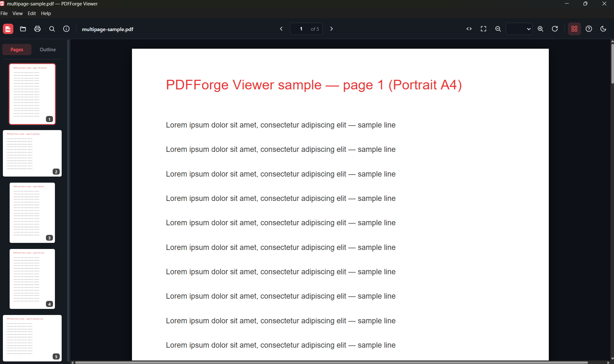

# PDFForge Viewer (Desktop)

A fast, private, offline desktop PDF viewer built with Electron and
[pdf.js](https://mozilla.github.io/pdf.js/). All rendering happens locally — no files are
uploaded anywhere.



## Features

- Continuous page scrolling rendered with pdf.js (WebAssembly not required)
- Zoom in/out, fit to width, fit to page, actual size
- Page navigation and a collapsible thumbnail rail
- Open PDFs via file dialog, drag & drop, command line, or Windows file association
- Print support via the system print dialog
- Light / dark themes
- Keyword shortcuts: `Ctrl+O`, `Ctrl+P`, `Ctrl++/-/0`, `←/→`, `PgUp/PgDn`, `Home/End`, `T` (thumbnails), `D` (dark mode)

## Getting started

```bash
npm install
npm run dev
```

To open a specific file:

```bash
npm run dev -- path/to/document.pdf
```

## Packaging

Build a Windows installer (and register `.pdf` file association):

```bash
npm run dist
```

The installer is written to `dist/`.

## Smoke test

Runs the app headless, opens a generated test PDF, and verifies a page renders:

```bash
npm run smoke
```

## Layout

- `electron/main.js` — main process, window, `app://` protocol serving the renderer and the pdf.js worker, IPC, menu
- `electron/preload.js` — sandboxed bridge exposing file open, theme, and menu commands
- `renderer/` — the viewer UI (vanilla JS + pdf.js, no bundler)